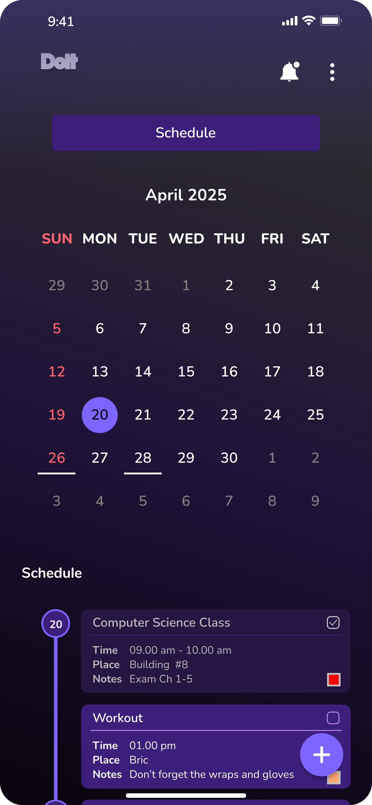
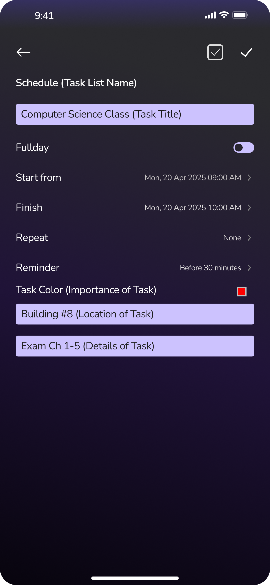

# Doit - Task & Calendar Organizer

**Doit** is a to-do list and calendar scheduling app designed to help users stay organized with a clean, intuitive interface. Featuring a dynamic calendar, task prioritization, and seamless navigation, Doit simplifies productivity without overwhelming the user.


### Opening Splash Screen


### Calendar View


### Task Form


## ✨ Features

- 📅 **Interactive Calendar View** – View and assign tasks directly on specific dates.
- ✅ **Task Creation & Editing** – Quickly add, edit, or delete tasks.
- 🔄 **Shared State Management** – Consistent data flow between calendar and task screens.
- 🎯 **Priority Indicators** – (Upcoming) Color-coded task priority levels.
- 💡 **Clean, Minimal UI** – Responsive and distraction-free design.

## 🚀 Getting Started

### Prerequisites

- Java 17 or higher
- JavaFX SDK
- IDE like IntelliJ IDEA or VSCode
- (Optional) Maven or Gradle for dependency management

### Clone the Repository

```bash
git clone https://github.com/yourusername/doit-todo-app.git
cd doit-todo-app


